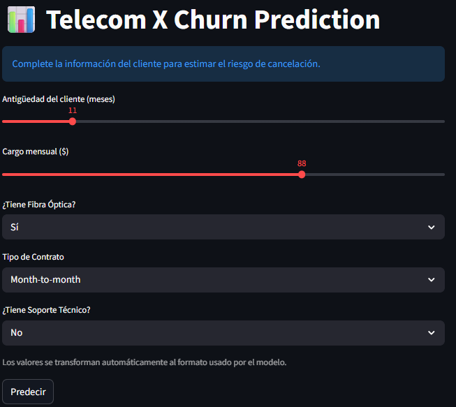
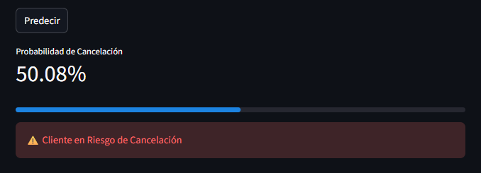
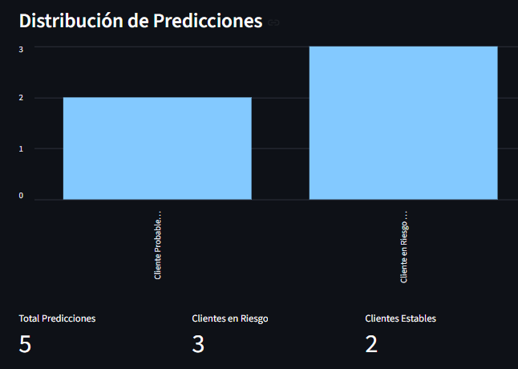
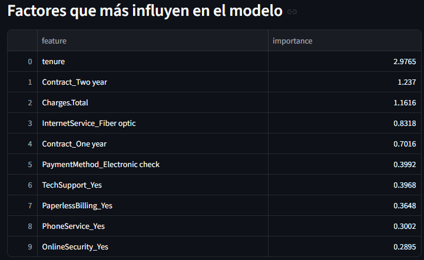
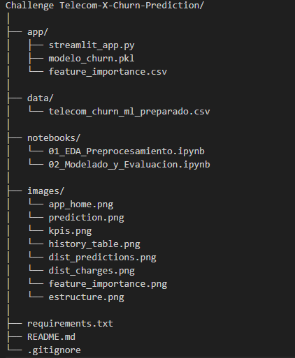

# Telecom X - Churn Prediction Project 📡

## 📣 Contexto del Desafío
Aplicación de Machine Learning que predice el riesgo de cancelación de clientes de una empresa de telecomunicaciones y permite analizar los factores que influyen en la decisión de abandono.

Proyecto desarrollado como parte del programa Oracle Next Education (ONE) - Alura LATAM.

## 🚀 Demo (Web App)
Aplicación interactiva desarrollada con Streamlit que permite:
1. Ingresar datos de un cliente
2. Obtener probabilidad de cancelación
3. Visualizar factores que influyen en la predicción
4. Consultar historial de predicciones
📷 Capturas incluidas más abajo

## 📸 Capturas de la App
    ### 🔹 Vista Principal
   

    ### 🔹 Resultado de Predicción
   

    ### 🔹 Dashboard de KPIs
   

    ### 🔹 Histórico de Predicciones
   

    ### 🔹 Distribución de Predicciones
   

    ### 🔹 Factores que Influencian
   

## 🧠 Objetivos del Proyecto
Construir un sistema predictivo que permita:
* Identificar clientes con alto riesgo de churn
* Apoyar decisiones de retención
* Explicar por qué el modelo toma cada decisión

## 🧠 Flujo del Proyecto
1. Exploración y limpieza de datos
2. Análisis exploratorio (EDA)
3. Ingeniería de características
4. Entrenamiento de modelos
5. Evaluación
6. Interpretabilidad
7. Despliegue web

#  🛠️ Tecnologías
* Python
* Pandas
* NumPy
* Scikit-learn : Construcción de modelos de ML
* Streamlit : Interfaz web para visualización
* Matplotlib
* Joblib

## 📁 Estructura de archivos

## 🧪 Validación del Modelo
Para asegurar que el modelo se encuentre correctamente entrenado y generalice adecuadamente, se realizaron las siguientes validaciones:

    📌 Consistencia de Métricas
    Se compararon métricas entre entrenamiento y prueba, obteniendo valores similares, lo que indica que el modelo no presenta sobreajuste (overfitting) ni subajuste (underfitting).
    Accuracy (test): ~79%
    Recall clase churn: ~53%
    El recall para churn es prioritario, ya que permite identificar clientes con alto riesgo de cancelación.

    📌 Análisis de Matriz de Confusión
    La matriz de confusión muestra que el modelo:
    Clasifica correctamente la mayoría de clientes que permanecen.
    Detecta una proporción significativa de clientes que cancelan.
    Esto lo hace útil para priorizar acciones de retención.

    📌 Coherencia con el Dominio del Negocio
    Los factores más influyentes aprendidos por el modelo concuerdan con el comportamiento real de clientes:
    Mayor antigüedad reduce churn.
    Contratos largos reducen churn.
    Cargos mensuales altos aumentan churn.
    Servicios adicionales actúan como factores protectores.
    Esta coherencia valida que el modelo aprende patrones reales y no ruido.

    📌 Conclusión
    El modelo presenta un equilibrio adecuado entre rendimiento e interpretabilidad, siendo apropiado para apoyar estrategias de retención y toma de decisiones comerciales.

## 📊 Resultados del Modelo
El modelo muestra buen desempeño general y capacidad de generalización, con métricas consistentes entre entrenamiento y prueba. Los patrones aprendidos son coherentes con el conocimiento del dominio, lo que valida su utilidad práctica para estrategias de retención.

* Modelo final: **Regresión Logística**
* Recall clase churn: 53%
* Accuracy aproximado: 79%
* Factores más influyentes:
    * Antigüedad del cliente (tenure)
    * Tipo de contrato
    * Cargos mensuales
    * Fibra óptica
    * Soporte técnico

## 🧩 Funcionalidades de la App
✔ Predicción con probabilidad
✔ Dashboard de KPIs
✔ Historial de predicciones
✔ Descarga de resultados
✔ Explicación de predicción

## ⚙️ Clona el repositorio
git clone https://github.com/jriojac/Challenge-Telecom-X-Churn-Prediction.git

## ⚙️ Ejecución Local
pip install -r requirements.txt
streamlit run app/streamlit_app.py

## ✅ Conclusiones
1. Existe un desbalance moderado entre clientes que cancelan (27%) y los que permanecen (73%).
2. La antigüedad del cliente (tenure) es el factor más importante para reducir la cancelación.
3. Los contratos de uno y dos años disminuyen significativamente la probabilidad de churn frente a contratos mensuales.
4. Los clientes con cargos más altos y aquellos que utilizan fibra óptica presentan mayor probabilidad de cancelar.
5. Servicios adicionales como soporte técnico, seguridad en línea y respaldo en línea actúan como factores protectores.
6. Entre los modelos evaluados, la Regresión Logística obtuvo el mejor desempeño para detectar cancelaciones, con un recall del 53% para la clase churn.

## 💡Recomendaciones de Negocio
1. Implementar programas de retención durante los primeros meses de servicio.
2. Incentivar contratos de largo plazo mediante descuentos o beneficios.
3. Ofrecer paquetes promocionales a clientes con cargos mensuales elevados.
4. Revisar la calidad y percepción del servicio de fibra óptica.
5. Promover servicios adicionales como soporte técnico y seguridad.
6. Diseñar campañas específicas para adultos mayores.

## 👩‍💻 Autor
Jacqueline Rioja
Data Scientist Jr
📫 jriojac@gmail.com

🔗 https://github.com/jriojac